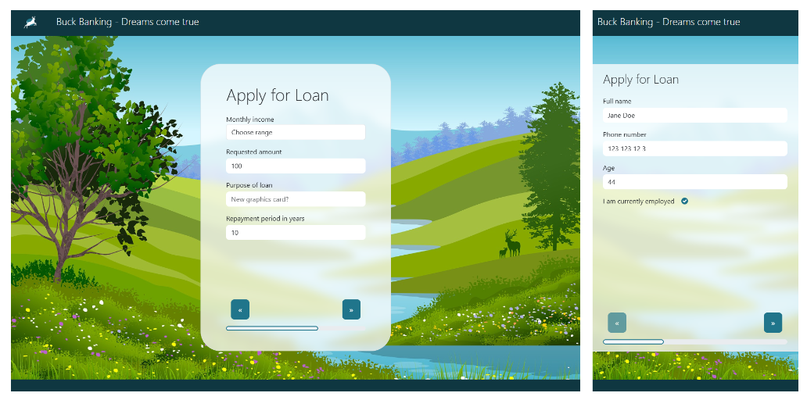

# React Loan Form

[Live Page](https://linneatoth.github.io/react_form/)

This is a multip-step loan application form built with **React** for a school assignment. My aim with the design was to make it clean, user-friendly and a playful within reasonable boundaries for a fincancial service. The project focuses on form handling, validation and a smooth experience across different devices.

## Features
- **React**, with hooks such as **useState**, **useEffect** 
- The form is divided into **multiple steps** to give a better experience
- The input is **validated** through a schema built with **Yup**
- **LocalStorage** is used to preserve input across refreshes
- Alert badge based on income through **conditional rendering**
- **Modal** feedback on submit with:
  - Loading spinner, with a simulated delay
  - **Disabled** close button during loading 
  - **Success message** 
  - **Validation error list**
- Form is **auto cleared** on submission
- Dynamic keys with **UUID**
- Styling and layout with **Bootstrap** and **Bootstrap-React**

# Assignment - machine translated from Swedish

> ## 📝 About the Assignment
> 
> In this exercise, you are tasked with creating a **loan application form** in **React**. The user should be able to enter their personal and financial details and submit an application. The focus is on practicing form handling, state management, and basic validation in React.
> 
> The final application should have a **clean design** and be **responsive**, working well on both desktop and mobile devices.
> 
> ---
> 
> ## 📋 Case
> 
> ---
> 
> ## 📌 What You Should Do
> 
> - **Create a new React project** (e.g. using Vite, Create React App, or another setup of your choice).
> - **Build a component** named something like `LoanForm.jsx`.
> - **Design a form** that includes the following fields:
>   - **Name** – Text input  
>   - **Phone number** – Text input, preferably numeric  
>   - **Age** – Number input  
>   - **Are you employed?** – Checkbox  
>   - **Your salary** – Dropdown / select menu with different salary ranges (e.g. "Less than $500", "$500 - $1000", "$1000 - $2000", "Over $2000")  
>   - **Loan amount** – Number input  
>   - **Purpose of the loan** – Text input  
>   - **Repayment period in years** – Number input  
>   - **Comments** – Textarea for additional messages
> - **Add a "Send" button** that the user clicks to submit their application.
> 
> ---
> 
> ## ⚙️ Functionality
> 
> - **State Management**:
>   - Use `useState` to keep track of form values.
>   - Each input field should be bound to a state variable.
> 
> - **Handling Form Submission**:
>   - When the user clicks "Send":
>     - Gather all field values into a **JavaScript object**.
>     - Output the object to the console using `console.log(application)`.
> 
> - **Basic Validation**:
>   - Ensure that **Name**, **Phone number**, and **Age** are not empty.
>   - If fields are missing, display a simple error message under the relevant field or as an alert.
> 
> - **Layout and Design**:
>   - The form should be centered on the page.
>   - Use a clean background (gradient, solid color, or image).
>   - Inputs and buttons should have rounded corners and spacing between them.
>   - Use flexbox or grid to layout the form nicely.
> 
> - **Responsiveness**:
>   - The form should adapt to various screen sizes (mobile, tablet, desktop).
>   - On smaller screens, fields should stack neatly under each other.
> 
> ---
> 
> ## ⭐ Extra Challenges (Grade VG)
> 
> - **Store form data in LocalStorage** so the information isn't lost if the page is reloaded.
> - **Show a confirmation** (e.g. "Thank you for your application!") after the user submits the form.
> - **Automatically clear the form** after successful submission.
> - **Make the "Your salary" field dynamic**: if the user selects "Less than $500", show an extra warning (e.g. "Note: A lower salary may affect your application").
> - **Use a validation schema**, for example using [Yup](https://github.com/jquense/yup) and `react-hook-form` for more advanced validation.
> - **Build a small loading animation** that shows when the form is submitted (simulate API call with `setTimeout`).
> - **~~Build the form in multiple steps (multi-step form)~~**, where the user fills out one section at a time.
